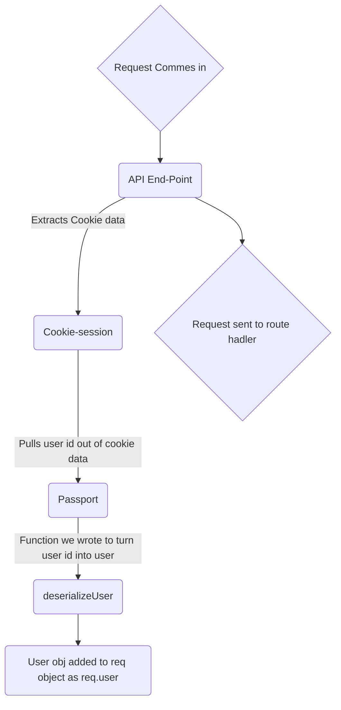

### API call middleware (Cookie + Auth) flow chart 

How to start client and server concurrently on local ?
-> npm run dev

How to start client and server on prod ?

HLD: https://drive.google.com/drive/folders/1qjibEgEUWrlKx54ZBiOJJbqKtfMrH1as?usp=sharing